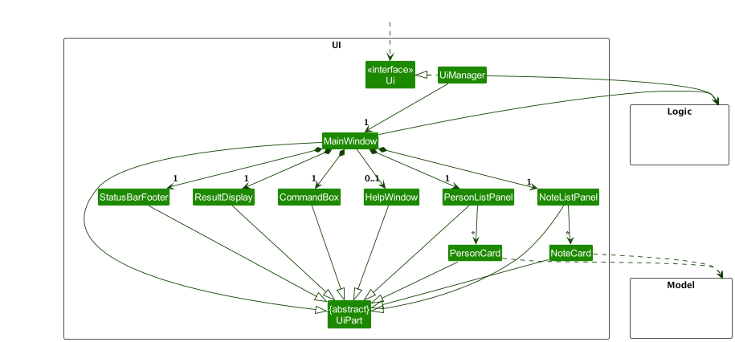
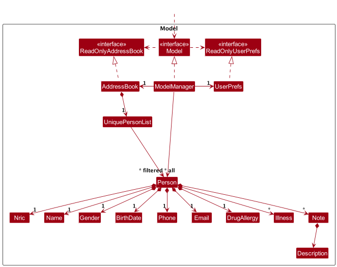
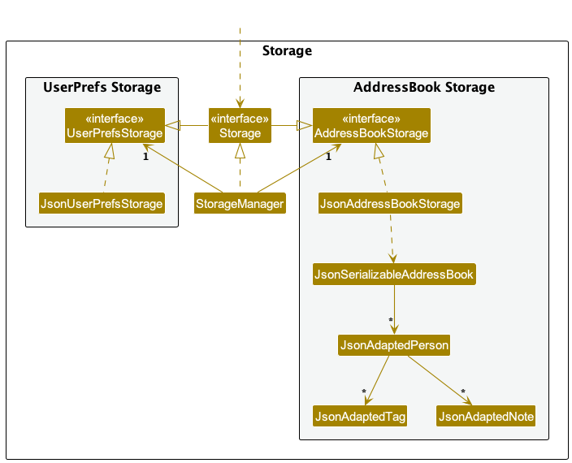
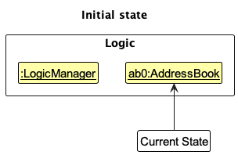
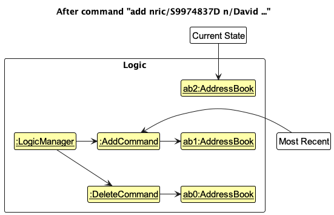
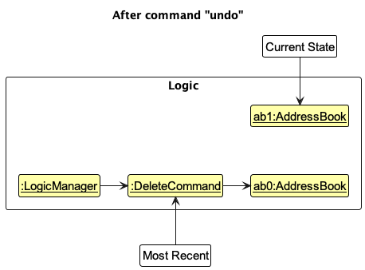
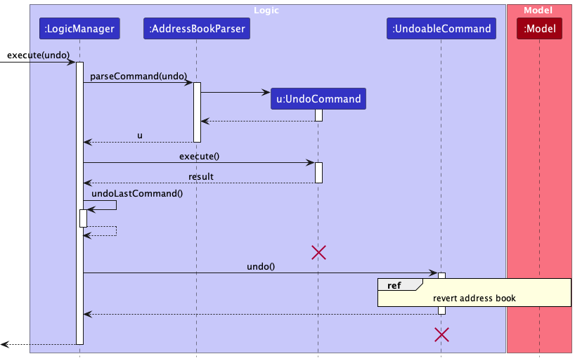
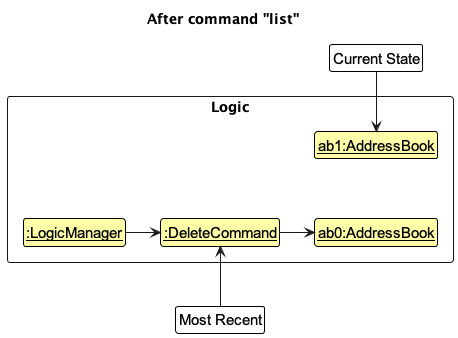
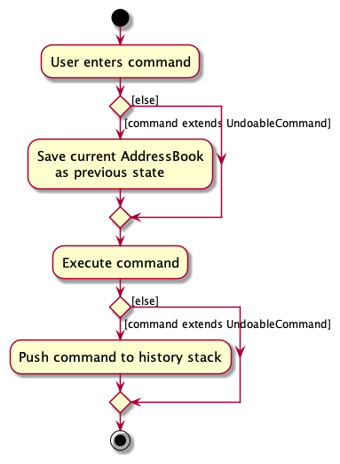

# Table of Contents

- [Table of Contents](#table-of-contents)
  - [**Acknowledgements**](#acknowledgements)
  - [**Setting up, getting started**](#setting-up-getting-started)
  - [**Design**](#design)
    - [Architecture](#architecture)
    - [UI component](#ui-component)
    - [Logic component](#logic-component)
    - [Model component](#model-component)
    - [Storage component](#storage-component)
    - [Common classes](#common-classes)
  - [**Implementation**](#implementation)
    - [Undo feature](#undo-feature)
      - [Implementation](#implementation-1)
      - [Design considerations:](#design-considerations)
    - [Find feature](#find-feature)
      - [Implementation](#implementation-2)
      - [Design considerations:](#design-considerations-1)
        - [Predicate Implementation](#predicate-implementation)
    - [Data archiving](#data-archiving)
      - [Overview](#overview)
      - [How It Works](#how-it-works)
      - [Execution Prerequisites](#execution-prerequisites)
      - [Archived File Location](#archived-file-location)
  - [**Documentation, logging, testing, configuration, dev-ops**](#documentation-logging-testing-configuration-dev-ops)
  - [**Appendix: Requirements**](#appendix-requirements)
    - [Product scope](#product-scope)
    - [User stories](#user-stories)
    - [Use cases](#use-cases)
      - [Use case: List all patient medical records](#use-case-list-all-patient-medical-records)
      - [Use case: Add patient medical record](#use-case-add-patient-medical-record)
      - [Use case: Edit patient medical record](#use-case-edit-patient-medical-record)
      - [Use case: List all patients' appointment notes](#use-case-list-all-patients-appointment-notes)
      - [Use case: Find specific patient(s) medical record](#use-case-find-specific-patients-medical-record)
      - [Use case: Delete a particular patient medical record](#use-case-delete-a-particular-patient-medical-record)
      - [Use case: List a particular patient's appointment notes](#use-case-list-a-particular-patients-appointment-notes)
      - [Use case: Add a patient's appointment note](#use-case-add-a-patients-appointment-note)
      - [Use case: Edit a patient's appointment note](#use-case-edit-a-patients-appointment-note)
      - [Use case: Delete a patient's appointment note](#use-case-delete-a-patients-appointment-note)
      - [Use case: Undo recent use command](#use-case-undo-recent-use-command)
      - [Use Case: Archive the Address Book](#use-case-archive-the-address-book)
    - [Non-Functional Requirements](#non-functional-requirements)
    - [Glossary](#glossary)
  - [**Appendix: Instructions for manual testing**](#appendix-instructions-for-manual-testing)
    - [Launch and shutdown](#launch-and-shutdown)
    - [Help Command](#help-command)
    - [Listing patient medical records](#listing-patient-medical-records)
    - [Add a patient medical record](#add-a-patient-medical-record)
    - [Edit a patient medical record](#edit-a-patient-medical-record)
    - [Find specific patient(s) medical record](#find-specific-patients-medical-record)
    - [Deleting a patient](#deleting-a-patient)
    - [List all patients’ appointment notes](#list-all-patients-appointment-notes)
    - [List a particular patient’s appointment notes](#list-a-particular-patients-appointment-notes)
    - [Add a patient’s appointment note](#add-a-patients-appointment-note)
    - [Edit a patient’s appointment note](#edit-a-patients-appointment-note)
    - [Delete a patient’s appointment note](#delete-a-patients-appointment-note)
    - [Undo recent user commands](#undo-recent-user-commands)
    - [Archive Command](#archive-command)
  - [**Planned Enhancements**](#planned-enhancements)

---

## **Acknowledgements**

- Adapted from [AB3](https://github.com/nus-cs2103-AY2324S2/tp)
- Thank you Prof Damith and our TA Sean for guiding the team towards completing the various milestones.

- Libraries Used:
  - JavaFX
  - Jackson
  - JUnit5
  - Mockito

---

## **Setting up, getting started**

Refer to the guide [_Setting up and getting started_](SettingUp.md).

---

## **Design**

:bulb: **Tip:** The `.puml` files used to create diagrams in this document `docs/diagrams` folder. Refer to the [
_PlantUML Tutorial_ at se-edu/guides](https://se-education.org/guides/tutorials/plantUml.html) to learn how to create
and edit diagrams.

### Architecture

The **_Architecture Diagram_** given above explains the high-level design of the App.

Given below is a quick overview of main components and how they interact with each other.

**Main components of the architecture**

**`Main`** (consisting of
classes [`Main`](https://github.com/se-edu/HealthSync-level3/tree/master/src/main/java/seedu/address/Main.java)
and [`MainApp`](https://github.com/se-edu/HealthSync-level3/tree/master/src/main/java/seedu/address/MainApp.java)) is in
charge of the app launch and shut down.

- At app launch, it initializes the other components in the correct sequence, and connects them up with each other.
- At shut down, it shuts down the other components and invokes cleanup methods where necessary.

The bulk of the app's work is done by the following four components:

- [**`UI`**](#ui-component): The UI of the App.
- [**`Logic`**](#logic-component): The command executor.
- [**`Model`**](#model-component): Holds the data of the App in memory.
- [**`Storage`**](#storage-component): Reads data from, and writes data to, the hard disk.

[**`Commons`**](#common-classes) represents a collection of classes used by multiple other components.

**How the architecture components interact with each other**

The _Sequence Diagram_ below shows how the components interact with each other for the scenario where the user issues
the command `delete 1`.

Each of the four main components (also shown in the diagram above),

- defines its _API_ in an `interface` with the same name as the Component.
- implements its functionality using a concrete `{Component Name}Manager` class (which follows the corresponding
  API `interface` mentioned in the previous point.

For example, the `Logic` component defines its API in the `Logic.java` interface and implements its functionality using
the `LogicManager.java` class which follows the `Logic` interface. Other components interact with a given component
through its interface rather than the concrete class (reason: to prevent outside component's being coupled to the
implementation of a component), as illustrated in the (partial) class diagram below.

The sections below give more details of each component.

### UI component

The **API** of this component is specified
in [`Ui.java`](https://github.com/se-edu/HealthSync-level3/tree/master/src/main/java/seedu/address/ui/Ui.java)

The UI consists of a `MainWindow` that is made up of parts
e.g.`CommandBox`, `ResultDisplay`, `PersonListPanel`, `NoteListPanel`, `StatusBarFooter` etc. All these, including
the `MainWindow`, inherit from the abstract `UiPart` class which captures the commonalities between classes that
represent parts of the visible GUI.

The `UI` component uses the JavaFx UI framework. The layout of these UI parts are defined in matching `.fxml` files that
are in the `src/main/resources/view` folder. For example, the layout of
the [`MainWindow`](https://github.com/se-edu/HealthSync-level3/tree/master/src/main/java/seedu/address/ui/MainWindow.java)
is specified
in [`MainWindow.fxml`](https://github.com/se-edu/HealthSync-level3/tree/master/src/main/resources/view/MainWindow.fxml)

The `UI` component,

- executes user commands using the `Logic` component.
- listens for changes to `Model` data so that the UI can be updated with the modified data.
- keeps a reference to the `Logic` component, because the `UI` relies on the `Logic` to execute commands.
- depends on some classes in the `Model` component, as it displays `Person` and `Note` object residing in the `Model`.

### Logic component

**API
** : [`Logic.java`](https://github.com/se-edu/HealthSync-level3/tree/master/src/main/java/seedu/address/logic/Logic.java)

Here's a (partial) class diagram of the `Logic` component:

The sequence diagram below illustrates the interactions within the `Logic` component, taking `execute("delete 1")` API
call as an example.

:information_source: **Note:** The lifeline for `DeleteCommandParser` should end at the destroy marker (X) but due to a limitation of PlantUML, the lifeline continues till the end of diagram.

How the `Logic` component works:

1. When `Logic` is called upon to execute a command, it is passed to an `AddressBookParser` object which in turn creates
   a parser that matches the command (e.g., `DeleteCommandParser`) and uses it to parse the command.
1. This results in a `Command` object (more precisely, an object of one of its subclasses e.g., `DeleteCommand`) which
   is executed by the `LogicManager`.
1. The command can communicate with the `Model` when it is executed (e.g. to delete a person). 
   Note that although this is shown as a single step in the diagram above (for simplicity), in the code it can take
   several interactions (between the command object and the `Model`) to achieve.
1. The result of the command execution is encapsulated as a `CommandResult` object which is returned back from `Logic`.

Here are the other classes in `Logic` (omitted from the class diagram above) that are used for parsing a user command:

How the parsing works:

- When called upon to parse a user command, the `AddressBookParser` class creates an `XYZCommandParser` (`XYZ` is a
  placeholder for the specific command name e.g., `AddCommandParser`) which uses the other classes shown above to parse
  the user command and create a `XYZCommand` object (e.g., `AddCommand`) which the `AddressBookParser` returns back as
  a `Command` object.

* All `XYZCommandParser` classes (e.g., `AddCommandParser`, `DeleteCommandParser`, ...) inherit from the `Parser`
  interface so that they can be treated similarly where possible e.g, during testing.

### Model component

**API
** : [`Model.java`](https://github.com/se-edu/HealthSync-level3/tree/master/src/main/java/seedu/address/model/Model.java)

The `Model` component,

- Please note all entity objects in the `Model` component are immutable.
- - stores a `UserPref` object that represents the user’s preferences. This is exposed to the outside as
    a `ReadOnlyUserPref` objects.

The `Person` entity,

- stores the address book data i.e., all `Person` objects (which are contained in a `UniquePersonList` object).
- stores the currently 'selected' `Person` objects (e.g., results of a search query) as a separate _filtered_ list which
  is exposed to outsiders as an unmodifiable `ObservableList<Person>` that can be 'observed' e.g. the UI can be bound to
  this list so that the UI automatically updates when the data in the list change.

The `Predicate<Person>` entity,

- stores the most recent filter predicate applied to the filteredPersons list.
- used when refreshing the filteredPersons to persist the filter.

The `Note` entity,

- each person has a list of `Note` objects which are stored in a `ObservableList`.
- when rebuilding a `Person` object, the `Note` objects can be copied over from the old `Person` object to the new one.
  Since all objects are immutable, this should not pose any issues.

### Storage component

**API
** : [`Storage.java`](https://github.com/se-edu/HealthSync-level3/tree/master/src/main/java/seedu/address/storage/Storage.java)

The `Storage` component,

- can save both address book data and user preference data in JSON format, and read them back into corresponding
  objects.
- inherits from both `HealthSyncStorage` and `UserPrefStorage`, which means it can be treated as either one (if only the
  functionality of only one is needed).
- depends on some classes in the `Model` component (because the `Storage` component's job is to save/retrieve objects
  that belong to the `Model`)

### Common classes

Classes used by multiple components are in the `seedu.address.commons` package.

---

## **Implementation**

This section describes some noteworthy details on how certain features are implemented.

### Undo feature

#### Implementation

The proposed undo mechanism is facilitated by `LogicManager` acting as the command invoker within the command pattern.
It implements the interface `CommandHistory` to manage a command history stack containing a set of `UndoableCommand` to
support the _undo feature_.
Below are the implemented `CommandHistory` operations:

- `LogicManager#addCommand(UndoableCommand )`— Adds an `UndoableCommand` to the history stack _(more of deque data
  structure in the actual implementation)_.
  The stack keeps track of at most 10 most recent actions.
- `LogicManager#undoLastCommand()`— Pops the most recent `UndoableCommand` from the history and restores the
  previous `AddressBook` state tracked by the `UndoableCommand` object that was popped.

Below is an example scenario on how the undo works with the command history stack maintained by the `LogicManager`

Step 1. The user launches the application for the first time.
The `LogicManager` will be initialized with an empty command history stack.

Step 2. The user executes `delete 1` command to delete the 1st patient medical record from the address book.
The `DeleteCommand` extends `UndoableCommand` and thus supports undoable behaviours.
The `DeleteCommand#execute()` is called and saves the current `AddressBook` state as the previous state before modifying
it to carry out the delete command.
After executing `DeleteCommand` the command object itself will be pushed into the command history managed by
the `LogicManager`.

Step 3. The user executes `add nric/S9974837D n/David …​` to add a new patient medical record.
The `AddCommand` command also calls `AddCommand#execute()`, similar to the delete command, it saves the
current `AddressBook` as the previous state before carrying out the add command.

    :information_source: **Note:**
    If a command fails it won't continue execution and error handlers will handle the respective `CommandException` thrown.
    The command would not be pushed into the history stack.

Step 4. The user now decides that adding the person was a mistake, and decides to undo that action by executing
the `undo` command.
The `undo` command will call `LogicManager#undoLastCommand`, and this would pop the most recent `UndoableCommand` as
explained above.
Once the `UndoableCommand` was popped the `UndoableCommand#undo()` is executed which reverts the `AddressBook` into the
previous state saved within the command.

    :information_source: **Note:**
    If the command history stack is empty then there is nothing to undo and the message "No commands left to undo." is returned as output to the user.

The following sequence diagram shows how an undo operation goes through the `Logic` component:

Step 5. The user then decides to execute the command `list`.
Commands like `ListCommand` that does not modify the address book does not extend `UndoableCommand` and would
execute `ListCommand#execute()` without saving prev state for undo feature.
Thus, the `LogicManager` command history remains unchanged.

    :information_source: **Note:**
    Once the command history stack contains 10 items, when a new `UndoableCommand` is executed least recent command *(bottom of the stack)* is removed
    and push the new one on the top.

The following activity diagram summarizes what happens when a user executes a new command:

#### Design considerations:

**Aspect: How undo executes:**

- **Current choice:** Saves the entire address book as prev state in each undoable command.
  - Pros: Easy to implement.
  - Cons: May have performance issues in terms of memory usage.

* **Alternative 2:** Individual command knows how to undo by
  itself. Instead of saving the whole address book within each command as prev state, only the change itself is saved.
  - Pros: Will use less memory (e.g. for `delete`, just save the person being deleted).
  - Cons: We must ensure that the implementation of each individual command are correct.

### Find feature

#### Implementation

The `FindCommand` feature allows user to search for patients in the patient book efficiently. It is implemented using
a `Predicate<Person>` to filer out the patient book.

The parsing of user input is handled by `FindCommandParser`. This parser constructs all the relevant predicates based on
the prefixes and keywords given by the user. It then combines the predicates which is used to construct `FindCommand`.

#### Design considerations:

##### Predicate Implementation

- **Alternative 1 (current choice):** Implement predicates as separate classes (e.g. name, gender, nric, etc.)

  - Pros: Better code readability as its own filtering logic is encapsulated in its own class.
  - Cons: Increases the number of classes, some duplication of similar logic code.

- **Alternative 2:** Combining predicate logic in a single class.
  - Pros: Reduces the number of classes.
  - Cons: Reduced readability and maintainability with mixed predicate test logic.

### Data archiving

#### Overview

The data archiving functionality is designed to provide a simple yet effective means of preserving historical records of
the addressBook.json file, which contains crucial address book data. By creating timestamped copies of this file, the
system ensures that previous states of the address book can be retrieved and reviewed as necessary.

#### How It Works

The archive feature operates by duplicating the existing addressBook.json file. This process involves creating a copy of
the file and then renaming this copy to include the current date and time, thereby creating a unique, timestamped
archive file. The format for the archived file's name is addressBook\_<currentDateTime>.json, where <currentDateTime> is
replaced with the actual date and time at which the archiving operation is performed. This naming convention facilitates
easy identification and retrieval of archived data.

#### Execution Prerequisites

For the archive operation to be executed successfully, the following conditions must be met:

Existence of addressBook.json: The archive feature is contingent upon the prior existence of an addressBook.json file.
This file serves as the source data for archiving, containing the current state of the address book that will be
preserved.
Initialization of the Address Book: The archiving process is intended to be performed after the address book has been
initialized and contains data. Archiving an empty or uninitialized address book may not be meaningful and is therefore
not recommended.
Archiving Process

To initiate the archiving process, a specific archive command or trigger must be executed. This command engages the
system to:

1. Verify the existence of the addressBook.json file.
2. Create a copy of addressBook.json.
3. Rename the copied file to addressBook\_<currentDateTime>.json, accurately reflecting the date and time of the
   archiving operation.
4. It's important to note that the archiving process is non-destructive to the current address book data. The original
   addressBook.json file remains intact and unchanged, ensuring that ongoing operations are not affected by the
   archiving process.

#### Archived File Location

Once the archiving operation is complete, the newly created archive file is stored within the data folder. This
centralized location ensures that all archived files are organized in a single, accessible place, making it easier for
developers and users to locate and manage historical data.

The data folder will, therefore, contain a series of timestamped files, each representing a snapshot of the address book
at different points in time. These archived files provide a valuable resource for data recovery, historical analysis,
and auditing purposes.

---

## **Documentation, logging, testing, configuration, dev-ops**

- [Documentation guide](Documentation.md)
- [Testing guide](Testing.md)
- [Logging guide](Logging.md)
- [Configuration guide](Configuration.md)
- [DevOps guide](DevOps.md)

---

## **Appendix: Requirements**

### Product scope

**Target user profile**:

- Dr. Emily Chen is a General Practitioner
- She aims to enhance clinical efficiency and maintain high-quality care
- Challenges include time constraints and documentation overload
- She needs seamless workflow management and a keyboard-driven system
- Her personality is dedicated and empathetic, with a focus on patient care
- Can type fast hence loves to play type racer during her free time
- Prefers to type over mouse interactions

**Value proposition**: manage patient medical records faster than a typical mouse/GUI driven app

### User stories

Priorities: High (must have) - `* * *`, Medium (nice to have) - `* *`, Low (unlikely to have) - `*`

| Priority | As a …​ | I want to …​                                  | So that I can…​                                            |
| -------- | ------- | --------------------------------------------- | ---------------------------------------------------------- |
| `* * *`  | user    | view all my patient's medical records         | have a clear overview of all my records                    |
| `* * *`  | user    | add a patient's medical record                | record new patients I work with                            |
| `* * *`  | user    | edit a patient's medical record               | amend necessary details of a medical record when needed    |
| `* * *`  | user    | delete a patient's medical record             | remove patient's medical record that I no longer need      |
| `* * *`  | user    | find patients with specific keywords          | locate existing patient records efficiently                |
| `* *`    | user    | list all patient's appointment notes          | view all existing appointment notes                        |
| `* * *`  | user    | list a particular patients' appointment notes | view a particular patient's existing appointment notes     |
| `* * *`  | user    | add a patient's appointment note              | record keep the details of each appointment                |
| `* * *`  | user    | edit a patient's appointment note             | update the details of an appointment                       |
| `* * *`  | user    | delete a patient's appointment note           | remove entries that I no longer need                       |
| `* *`    | user    | access a help page for quick reference        | have a better idea where to get started                    |
| `* *`    | user    | undo my recent commands                       | I can use the application efficiently during my work hours |
| `* *`    | user    | archive my addressbook                        | backup my addressbook as and when I need                   |

### Use cases

(For all use cases below, the **System** is the `HealthSync` and the **Actor** is the `user`, unless specified
otherwise)

#### Use case: List all patient medical records

**MSS**

1. User requests to list all patient medical records.
2. HealthSync shows a list of all the patient medical records. 
   Use case ends.

**Extensions**

- 2a. The list of patient medical records displayed is empty. 
  Use case ends.

#### Use case: Add patient medical record

**MSS**

1. User enters the new patient medical record information.
2. HealthSync adds the new patient medical record into the application. 
   Use case ends.

**Extensions**

- 1a. User entered invalid / incorrect information.
  - 1a1. HealthSync shows an error message. 
    Use case resumes at 1.

#### Use case: Edit patient medical record

**MSS**

1. User requests to list patients medical records
2. HealthSync shows the patient medical records list.
3. User enters the edited information of a patient medical record.
4. HealthSync edits the respective patient medical record with the new information. 
   Use case ends.

**Extensions**

- 2a. The list of patient medical records is empty.
  Use case ends.
- 3a. The given patient index is invalid.
  - 3a1. HealthSync shows an error message. 
    Use case resumes at step 3.

[//]: # "TODO: find and delete patient"

#### Use case: List all patients' appointment notes

**MSS**

1. User requests to list all appointment notes
2. HealthSync shows a list of appointment notes

   Use case ends.

**Extensions**

- 2a. The list of appointment notes is empty.

  Use case ends.

#### Use case: Find specific patient(s) medical record

**MSS**

1. User finds the patient medical record with keywords such as gender, name etc.
2. HealthSync filters the patient records and displays the relevant ones that matches the search filter.

   Use case ends.

**Extensions**

- 1a. The given search filter parameters are invalid
  - 1a1. HealthSync shows an error message
    Use case resumes at step 1.
- 2a. No patient medical record matches the filter.

  - 2a1. HealthySync displays empty list.

    Use case ends.

#### Use case: Delete a particular patient medical record

**MSS**

1. User requests to list patients medical records
2. HealthSync shows a list of patients medical records
3. User requests to delete a specific patient's medical record in the list
4. HealthSync deletes the patient's medical record

   Use case ends.

**Extensions**

- 2a. The list is empty.
  Use case ends.
- 3a. The given patient index is invalid.
  - 3a1. HealthSync shows an error message
    Use case resumes at step 2.
- 3b. The given appointment note index is invalid.
  - 3b1. HealthSync shows an error message.
    Use case resumes at step 2.

#### Use case: List a particular patient's appointment notes

**MSS**

1. User requests to view a particular patient's appointment notes
2. HealthSync shows a list of appointment notes

   Use case ends.

**Extensions**

- 1a. The given patient index is invalid.

  - 1a1. HealthSync shows an error message.

    Use case resumes at step 1.

- 2a. The list of appointment notes is empty.

  Use case ends.

#### Use case: Add a patient's appointment note

**MSS**

1. User requests to list patients
2. HealthSync shows a list of patients
3. User requests to add an appointment note for a given patient
4. HealthSync adds the appointment note

   Use case ends.

**Extensions**

- 2a. The list of patients is empty.

  Use case ends.

- 3a. The given patient index is invalid.

  - 3a1. HealthSync shows an error message.

    Use case resumes at step 2.

#### Use case: Edit a patient's appointment note

**MSS**

1. User requests to list patients
2. HealthSync shows a list of patients
3. User requests to edit an appointment note for a given patient
4. HealthSync edits the appointment note

   Use case ends.

**Extensions**

- 2a. The list of patients is empty.

  Use case ends.

- 3a. The given patient index is invalid.

  - 3a1. HealthSync shows an error message.

    Use case resumes at step 2.

- 3b. The given appointment note index is invalid.

  - 3b1. HealthSync shows an error message.

    Use case resumes at step 2.

#### Use case: Delete a patient's appointment note

**MSS**

1. User requests to list patients
2. HealthSync shows a list of patients
3. User requests to delete a specific person in the list
4. HealthSync deletes the person

   Use case ends.

**Extensions**

- 2a. The list is empty.

  Use case ends.

- 3a. The given patient index is invalid.

  - 3a1. HealthSync shows an error message.

    Use case resumes at step 2.

- 3b. The given appointment note index is invalid.

  - 3b1. HealthSync shows an error message.

    Use case resumes at step 2.

#### Use case: Undo recent use command

**MSS**

1. User request to undo command.
2. HealthSync undo the most recent undoable command the user has previously done.

   Use case ends.

**Extensions**

- 1a. User has not done any undoable commands previously.
  - 1a1. HealthSync shows a message to about no undoable commands to undo. 
    Use case ends.

#### Use Case: Archive the Address Book

**MSS**

1. User requests to archive the address book.
2. HealthSync creates a timestamped archive of the current address book state, saving it in a designated data folder.
3. HealthSync confirms the successful archiving of the address book.
   Use case ends.

**Extensions**

None required. The archiving process is a simple, direct action that does not have conditional branches based on the user input or system state that would necessitate extensions.

### Non-Functional Requirements

1. Should work on any _mainstream OS_ as long as it has Java `11` or above installed.
2. Should be able to hold up to 1000 patients without a noticeable sluggishness in performance for typical usage.
3. Should be able to hold up to 200 appointment note per patient without a noticeable sluggishness in performance for
   typical usage.
4. A user with above average typing speed for regular English text (i.e. not code, not system admin commands) should be
   able to accomplish most of the tasks faster using commands than using the mouse.

### Glossary

- **Mainstream OS**: Windows, Linux, Unix, MacOS
- **Patient's medical record**: Essential information about a patient, including name, NRIC, phone number and other
  relevant details

* **Patient's appointment note**: Information on a scheduled patient appointment, including date, time and assessment
* **Undoable Commands**: Add, Edit, Delete like commands.

---

## **Appendix: Instructions for manual testing**

Given below are instructions to test the app manually.

:information_source: **Note:** These instructions only provide a starting point for testers to work on;
testers are expected to do more *exploratory* testing.

### Launch and shutdown

1. Initial launch

   1. Download the jar file and copy into an empty folder
   1. Double-click the jar file Expected: Shows the GUI with a set of sample contacts. The window size may not be
      optimum.

1. Saving window preferences
   1. Resize the window to an optimum size. Move the window to a different location. Close the window.
   1. Re-launch the app by double-clicking the jar file. 
      Expected: The most recent window size and location is retained.

### Help Command

1. Test the functionality of the `help` command to ensure it displays all available commands and their brief usage.
   1. Test case: `help`  
      Expected: A list of all available commands along with a brief description of each is displayed to the user.
   2. Test case: `help add`  
      Expected: Detailed usage of the `add` command is shown.

### Listing patient medical records

1. List all patient medical records
   1. Prerequisites: Multiple patient medical records has already been created and stored.
   2. Test case: `list`  
      Expected: All the patient medical records are displayed.

### Add a patient medical record

1. Add a patient medical record into the application.
   1. Test case: `add ic/S9974943C n/John Mark p/91234567 e/john@email.com g/M b/11-11-1990 d/Paracetamol Allergy i/Infectious Disease`  
      Expected: All patient medical records are displayed with the new patient medical record.
   2. Test case: `add ic/S9974846F n/Matthew Bard b/07-10-1999 p/81234567 e/marky@email.com` (missing optional fields)  
      Expected: All patient medical records are displayed with the new patient medical record but with default values for the optional fields excluded in the input.
   3. Test case: `add ic/S9974943C n/Shane Santos b/02-11-2000 p/82345678 e/shane@email.com` (duplicate person same NRIC)  
      Expected: No new patient medical record is added. Error will appear as a result notifying the user.
   4. Test case: `add ic/invalidNRIC n/Jane Cleofas b/02-05-2000 p/83456789 e/jane@email.com` (invalid argument value)  
      Expected: No new patient medical record is added. Error will appear as a result notifying the user that the information supplied is invalid.

### Edit a patient medical record

1. Edit a patient medical record.
   1. Prerequisites: At least one patient medical records are created and stored.
   2. Test case: `edit 1 n/Cindy Tan p/94505333 e/editedmail@mail.com g/F b/11-11-1991 d/Antibiotic Allergy i/Genetic Disorders`
      Expected: The particular patient medical record `1` is edited with the new information.
   3. Test case: `edit 1 n/Cindy May Tan`
      Expected: The particular patient medical record `1` is edited with the new name information.
   4. Test case: `edit 1` (no new edit information provided)
      Expected: The particular patient medical record `1` is not edited and error message is shown to the user.
   5. Test case: `edit 999 n/New name`
      Expected: No edit made and error about invalid index is shown.
   6. Test case: `edit` (invalid command)
      Expected: No edit made and error about invalid command is shown.
2. Edit a patient medical record after find command.
   1. Prerequisites: Multiple patient medical records are created and stored and > 1 with gender M.
   2. Test case: `find g/M` then  
      `edit 1 g/F`  
      Expected: Edit is made to the respective record, and it should disappear in the current filtered patient medical record list as the current list displayed is filtered by gender M.
      `list` should display all the medical records again and should see the specific edited record now reflects the new gender information.
   3. Test case: `find g/M` then  
      `edit 1 n/Edited Name`  
      Expected: Edit is made to the respective medical record `1` in the current filtered list.

### Find specific patient(s) medical record

1. Find patient medical record.
   1. Prerequisites: At least one patient medical records are created and stored.
   2. Test case: `find n/Cindy`
      Expected: Patient's medical records from patients named Cindy returned.
   3. Test case: `find n/Cindy May Jack`
      Expected: Patient's medical records from patients named Cindy, May and Jack are returned.
   4. Test case: `find n/Taylor g/M`
      Expected: Patient's medical records from patients named Taylor that are male are returned.
   5. Test case: `find i/diseases others`
      Expected: Patient's medical records from patients with Infectious Diseases, Degenerative Diseases
      and Others illness categories
   6. Test case: `find` (invalid command)
      Expected: No find made and error about invalid command is shown.
   7. Test case: `find name/Jack` (invalid command)
      Expected: No find made and error about invalid command is shown.
   8. Test case: `find n/Jack n/John` (invalid command)
      Expected: No find made and error about invalid command is shown.
   9. Test case: `find i/diseases sickness` (invalid command)
      Expected: No find made and error about invalid command is shown.

### Deleting a patient

1. Deleting a patient while patients are being shown
   1. Prerequisites: List all persons using the `list` command. Multiple persons in the list.
   1. Test case: `delete 1` 
      Expected: First patient is deleted from the list. Details of the deleted patient shown in the status message.
      Timestamp in the status bar is updated.
   1. Test case: `delete 0` 
      Expected: No patient is deleted. Error details shown in the status message. Status bar remains the same.
   1. Other incorrect delete commands to try: `delete`, `delete x`, `...` (where x is larger than the list size) 
      Expected: Similar to previous.

### List all patients’ appointment notes

1. List all patients’ appointment notes
   1. Prerequisites: Multiple patients and appointment notes stored.
   1. Test case: `list-an` 
      Expected: All appointment notes are displayed.

### List a particular patient’s appointment notes

1. List a particular patient’s appointment notes

   1. Prerequisites: Multiple patients and appointment notes stored. Each patient must have at least 1 appointment
      note.
   1. Test case: `list-an 1` 
      Expected: All appointment notes are displayed for the patient in index 1. Appointment notes from other patients
      should not appear.

1. List a particular patient’s appointment notes with no patients
   1. Prerequisites: No patients are stored.
   1. Test case: `list-an 1` (invalid index) 
      Expected: No appointment notes should appear. Error will appear in the status message.

### Add a patient’s appointment note

1. Add a patient’s appointment note

   1. Prerequisites: Multiple patients are stored.
   1. Test case: `add-an 1 d/19-02-2024 t/1130 n/General Flu` 
      Expected: All appointment notes are displayed with the additional new appointment note.
   1. Test case: `add-an 1 d/19-02-2024 t/1130` (missing compulsory field) 
      Expected: No appointment note is added. Error will appear in the status message.

1. Add a patient’s appointment note with no patients
   1. Prerequisites: No patients are stored.
   1. Test case: `add-an 1 d/19-02-2024 t/1130 n/General Flu` (invalid index) 
      Expected: No appointment note is added. Error will appear in the status message.

### Edit a patient’s appointment note

1. Edit a patient’s appointment note

   1. Prerequisites: Multiple patients and appointment notes stored. Each patient must have at least 1 appointment
      note. List notes of patient `1` by `list-an 1`.
   1. Test case: `edit-an 1 1 d/19-02-2024 t/1230 n/General Flu` 
      Expected: The particular appointment note will be edited with the information above.
   1. Test case: `edit-an 1 1 n/General Flu` (partial update) 
      Expected: The particular appointment note will be edited with the information above.
   1. Test case: `edit-an 1 d/19-02-2024 t/1230 n/General Flu` (missing compulsory field) 
      Expected: No appointment note is added. Error will appear in the status message.

1. Edit a patient’s appointment note with no patients
   1. Prerequisites: No patients are stored.
   1. Test case: `edit-an 1 1 d/19-02-2024 t/1230 n/General Flu` (invalid index) 
      Expected: No appointment note is edited. Error will appear in the status message.

### Delete a patient’s appointment note

1. Delete a patient’s appointment note

   1. Prerequisites: Multiple patients and appointment notes stored. Each patient must have at least 1 appointment
      note. List notes of patient `1` by `list-an 1`.
   1. Test case: `delete-an 1 1` 
      Expected: Appointment note of patient `1` with index `1` will be deleted.
   1. Test case: `delete-an 1` (missing compulsory field) 
      Expected: No appointment note is deleted. Error will appear in the status message.

1. Delete a patient’s appointment note with no patients
   1. Prerequisites: No patients are stored.
   1. Test case: `delete-an 1 1` (invalid index) 
      Expected: No appointment note is deleted. Error will appear in the status message.

### Undo recent user commands

1. Undo the user's recent patient related undoable command

   1. Test Case:

      - `add ic/S9874943Z n/John Mark p/91234567 e/john@email.com g/M b/11-11-1990 d/Paracetamol Allergy i/Infectious Disease`
      - `edit 1 n/Edited Name`
      - `delete 1`
      - `undo` 3 times  
        Expected: Should be back to the initial state before the test case was executed showing successful undo of the Add/Edit/Delete commands.

   2. Test Case:

      - `add ic/S9874943Z n/John Mark p/91234567 e/john@email.com g/M b/11-11-1990 d/Paracetamol Allergy i/Infectious Disease`
      - `edit INDEX_OF_NEW_RECORD n/1`
      - `edit INDEX_OF_NEW_RECORD n/2`
      - Keep doing edit command until `n/10`
      - `undo` until nothing left to undo  
        Expected: The application only tracks 10 most recent undoable commands. This results in undoing all the Edit commands but is unable to undo the Add command.

1. Undo the user's recent patient appointment note related undoable command

   1. Test Case:
      - Execute a sequence of appointment related commands:
        - `add-an 1 d/22-02-2024 t/1430 n/Stomach`
        - `edit-an 1 1 n/General Flu`
        - `delete-an 1 1`
      - Followed by `undo` 3 times  
        Expected: Should be back to the initial state before the test case was executed, showing successful undo of the Add/Edit/Delete of the appointment notes commands.

### Archive Command

1. Test the functionality of the `archive` command to ensure it creates a timestamped snapshot of the current address book state.
   1. Test case: `archive`  
      Expected: A new file named `addressBook_YYYY_MM_DD_T.json` is created in the data folder, indicating the archive was successful. The exact filename will vary based on the current date and time.

## **Planned Enhancements**

Team size: 5

Current behaviour is based of `v1.3 - v1.4`

1. **Improved Success / Error Messages for `add` and `edit`**:
   1. **Success Messages:** The current behaviour of the application shows success messages with missing information are shown to the user after the commands `add` and `edit` are executed successfully.
     As stated by bug issues: [#112](https://github.com/AY2324S2-CS2103-F09-4/tp/issues/112), [#108](https://github.com/AY2324S2-CS2103-F09-4/tp/issues/108), [#97](https://github.com/AY2324S2-CS2103-F09-4/tp/issues/97).
     We plan to update the success messages with the missing attributes of the added or edited medical record.
     For instance, it should include Drug Allergy, Birthdate, Gender, NRIC for successful commands.
     For the `edit` success message on top of the missing attributes, edited attributes can be specified as well to the end user.

   2. **Error Messages:** The current behaviour of the application shows vague error messages when an invalid PATIENT_INDEX for `edit` command is entered.
     To tackle the respective bug issues [#128](https://github.com/AY2324S2-CS2103-F09-4/tp/issues/128) and [#127](https://github.com/AY2324S2-CS2103-F09-4/tp/issues/127) we plan to update the error message for `edit` to account for invalid PATIENT_INDEX and show 'The index provided is invalid'.

   All these message fixes would be formatted better with proper 'break-lines' as well.

2. **Improved validation checking for NRIC and Email for `add` and `edit`**:
   1. **Improve NRIC digits validation**: The current application only validates whether it is in the format of '[S/T/F/G/M]XXXXXXX[A-Z]'.
     It does not account the digits whether it is actually valid as addressed by bug issue [#85](https://github.com/AY2324S2-CS2103-F09-4/tp/issues/85).
     We plan to improve the validation by also considering if the digits are valid with respect to the official Singapore NRIC format which considers birth year and more.

   2. **Improve Email validation**: The current application does not check if the @domain is valid such as whether it contains a top level domain as addressed by bug issues [#114](https://github.com/AY2324S2-CS2103-F09-4/tp/issues/114), [#105](https://github.com/AY2324S2-CS2103-F09-4/tp/issues/105).
     Hence, we plan on improving the validation to also consider if the domain provided has a top level domain or whether the domain itself corresponds to an actual legitimate domain.
  
3. **UI Improvements**
   1. **Footer:** In the current design, the footer does not consistently stick to the bottom of the window, especially when resizing to large windows.
   As stated by bug issue: [#117](https://github.com/AY2324S2-CS2103-F09-4/tp/issues/117).
   We plan to update this by modifying the UI layout slightly so that the footer sticks to the bottom of the window at all times.
