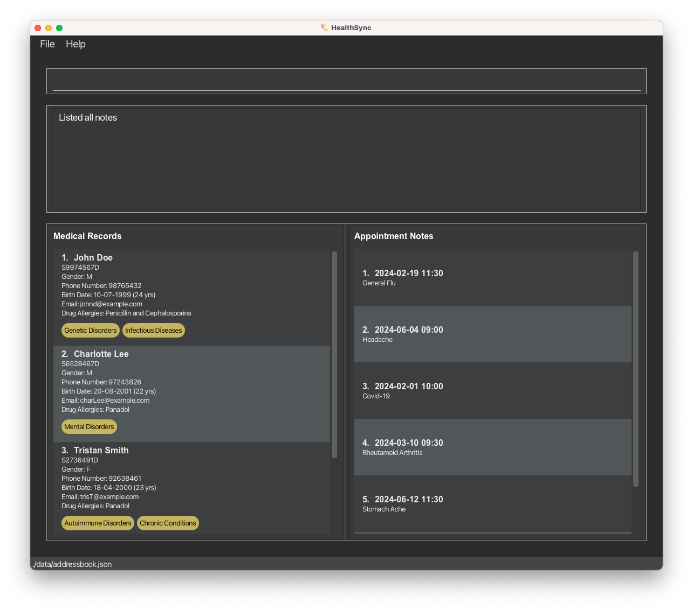

**HealthSync** helps optimize clinical efficiency with a keyboard-driven system for doctors to manage patient records,
notes, medical certificates, and medication dispensing, all in one streamlined interface, enhancing care quality and
focus in a busy clinical setting. While it has a GUI, most of the user interactions happen using a CLI (Command Line
Interface).

# Table of Contents

- [Table of Contents](#table-of-contents)
  - [Quick start](#quick-start)
  - [Features](#features)
    - [Viewing Help Information: `help`](#viewing-help-information-help)
    - [Adding a patient medical record: `add`](#adding-a-patient-medical-record-add)
    - [Listing all patient medical records : `list`](#listing-all-patient-medical-records--list)
    - [Editing a patient medical record : `edit`](#editing-a-patient-medical-record--edit)
    - [Deleting a patient medical record : `delete`](#deleting-a-patient-medical-record--delete)
    - [Locating a patient medical record : `find`](#locating-a-patient-medical-record--find)
    - [Listing all appointment notes: `list-an`](#listing-all-appointment-notes-list-an)
    - [Listing a particular patient's appointment notes: `list-an`](#listing-a-particular-patients-appointment-notes-list-an)
    - [Adding an appointment note: `add-an`](#adding-an-appointment-note-add-an)
    - [Editing an appointment note: `edit-an`](#editing-an-appointment-note-edit-an)
    - [Deleting an appointment note : `delete-an`](#deleting-an-appointment-note--delete-an)
    - [Clearing all entries : `clear`](#clearing-all-entries--clear)
    - [Undo previous commands : `undo`](#undo-previous-commands--undo)
    - [Archiving Data Files: `archive`](#archiving-data-files-archive)
    - [Exiting the program : `exit`](#exiting-the-program--exit)
    - [Saving the data](#saving-the-data)
    - [Editing the data file](#editing-the-data-file)
  - [FAQ](#faq)
  - [Known issues](#known-issues)
  - [Command summary](#command-summary)

---

## Quick start

1. Ensure you have Java `11` or above installed in your Computer.

1. Download the latest `healthsync.jar` from [here](https://github.com/AY2324S2-CS2103-F09-4/tp/releases).

1. Copy the file to the folder you want to use as the _home folder_ for your HealthSync.

1. Open a command terminal, `cd` into the folder you put the jar file in, and use the `java -jar healthsync.jar` command
   to run the application. 
   A GUI similar to the below should appear in a few seconds. Note how the app contains some sample data. 
   

1. Type the command in the command box and press Enter to execute it. e.g. typing **`help`** and pressing Enter will
   open the help window. 
   Some example commands you can try:

   - `list` : Lists all patient medical records.

   - `add ic/S9974943C n/John Mark p/91234567 e/john@email.com g/M b/11-11-1990 d/Paracetamol Allergy i/Infectious Disease`:
     Adds a patient medical record with the details respectively to the application.

   - `delete 3` : Deletes the 3rd medical record shown in the current list.

   - `clear` : Deletes all patient medical records.

   * `exit` : Exits the app.

1. Refer to the [Features](#features) below for details of each command.

---

## Features

**:information_source: Notes about the command format:** 

- Words in `UPPER_CASE` are the parameters to be supplied by the user. 
  e.g. in `add n/NAME`, `NAME` is a parameter which can be used as `add n/John Doe`.

* Items in square brackets are optional. 
  e.g. `n/NAME [g/GENDER]` can be used as `n/John Doe g/M` or as `n/John Doe`.

* Items with `…`​ after them can be used multiple times including zero times. 
  e.g. `[i/ILLNESS]…​` can be used as ` ` (i.e. 0 times), `i/Infectious Diseases`, `i/Infectious Diseases i/Genetic Disorders` etc.

- Parameters can be in any order. 
  e.g. if the command specifies `n/NAME p/PHONE_NUMBER`, `p/PHONE_NUMBER n/NAME` is also acceptable.

* Extraneous parameters for commands that do not take in parameters (such as `list`, `undo`, `exit` and `clear`) will be
  ignored. 
  e.g. if the command specifies `undo 123`, it will be interpreted as `undo`.

- If you are using a PDF version of this document, be careful when copying and pasting commands that span multiple lines
  as space characters surrounding line-breaks may be omitted when copied over to the application.

### Viewing Help Information: `help`

Provides detailed information on how to use commands within the Healthsync application, facilitating effective management of patient medical and appointment records.

**Format**:

- `help` Lists all available commands along with their usage.
- `help COMMAND` Displays detailed help for a specific command.
- `COMMAND` refers to any available command in Healthsync for which you seek detailed information.

**Examples**:

- Entering `help` in Healthsync will display a comprehensive list of all commands, including their formats and brief descriptions, to assist in navigating the system.
- Typing `help add` will present detailed information about the `add` command, including its format, required and optional parameters, and examples of usage.

This enhancement to the `help` feature allows for more targeted assistance, enabling users to quickly find the information they need for any specific command, in addition to understanding the overall functionality available within Healthsync.

### Adding a patient medical record: `add`

Adds a patient medical record to the system.

Format: `add ic/NRIC n/NAME [g/GENDER] b/BIRTHDATE p/PHONE_NUMBER e/EMAIL [d/DRUG_ALLERGY] [i/ILLNESS]...`

- `NRIC` must be an alphanumeric and it must follow Singapore's NRIC format '[S/T/F/G/M]XXXXXXX[A-Z]'.
- `NAME` should only contain alphanumeric characters and spaces.
- `GENDER` M, F or exclude from the command for 'Prefer not to say' option. _*Case-insensitive e.g. m instead of M._
- `PHONE_NUMBER` should be in valid Singapore phone number format.
  Must start with 6, 8, or 9 and be followed by seven additional digits, with no spaces or other characters.
- `BIRTHDATE` must be in the form of DD-MM-YYYY and must not be in the future.
- `EMAIL` should be of the format 'local-part@domain'.
  - 'local-part' constraints:
    - Should only contain alphanumeric characters and special characters excluding parentheses, +_.-
    - May not start or end with any special characters.
  - 'domain' constraints:
    - Must end with a domain label at least 2 characters long.
    - Must have each domain label start and end with alphanumeric characters.
    - Must have each domain label consist of alphanumeric characters, separated only by hyphens, if any.
- `DRUG_ALLERGY` can contain alphanumerics, spaces and special characters.
- `ILLNESS` could be of the following options - Infectious Disease, Chronic Conditions, Autoimmune Disorders,
  Genetic Disorders, Mental Health Disorders, Neurological Disorders, Metabolic Disorder, Nutritional Deficiencies,
  Environmental Illnesses, Degenerative Diseases or Others. You can also type the first few letters / words of the illness name as long it corresponds to a valid name for convenience.

Examples:

- `add ic/S9974944F n/John Doe p/91234567 e/johndoe@email.com g/M b/11-11-1990 d/Paracetamol Allergy i/Infectious Diseases` Adds a new
  patient record with nric of `S9974944F` name of `John Doe`, phone no. of `+65 91234567`, gender of `Male`,
  birthdate of `11-11-1990`, allergy of `Paracetamol Allergy`, and an illness category of `Infectious Diseases`.

### Listing all patient medical records: `list`

Displays the list of patients in the application. Each row of patients displays a basic details of the patients
(e.g. name, gender, age, illness, phone number)

Format: `list`

### Editing a patient medical record: `edit`

Edits a particular patient medical record. Users can select which particular detail to be updated.

Format: `edit PATIENT_INDEX [n/NAME] [p/PHONE_NUMBER] [e/EMAIL] [g/GENDER] [b/BIRTHDATE] [d/DRUG_ALLERGY] [i/ILLNESS]...`

:bulb: **Tip:**
Edit should have at least one parameter / detail to update. Also, nric is not allowed be edited remake the record
if new nric is needed.

- Edits the medical record at the specified `PATIENT_INDEX`. The index refers to the index number shown in the
  displayed patient medical record list. The index **must be a positive integer** 1, 2, 3, …​

- `NAME` should only contain alphanumeric characters and spaces.
- `PHONE_NUMBER` should be in valid Singapore phone number format.
  Must start with 6, 8, or 9 and be followed by seven additional digits,
  with no spaces or other characters.
- `EMAIL` should be of the format 'local-part@domain'.
  - 'local-part' constraints:
    - Should only contain alphanumeric characters and special characters excluding parentheses, +_.-
    - May not start or end with any special characters.
  - 'domain' constraints:
    - Must end with a domain label at least 2 characters long.
    - Must have each domain label start and end with alphanumeric characters.
    - Must have each domain label consist of alphanumeric characters, separated only by hyphens, if any.
- `GENDER` M, F or exclude from the command for 'Prefer not to say' option. `g/` with empty argument to remove any
  gender specification and make it 'Prefer not to say'. _*Case-insensitive e.g. m instead of M._
- `BIRTHDATE` must be in the form of DD-MM-YYYY and must not be in the future.
- `DRUG_ALLERGY` can contain alphanumerics, spaces and special characters. `d/` with empty argument to remove any
  allergy previously written.
- `ILLNESS` could be of the following options - Infectious Disease, Chronic Conditions, Autoimmune Disorders,
  Genetic Disorders, Mental Health Disorders, Neurological Disorders, Metabolic Disorder, Nutritional Deficiencies,
  Environmental Illnesses, Degenerative Diseases or Others. A single `i/` with empty argument would remove
  all illness category associated with the medical record. You can also type the first few letters / words of the illness name as long it corresponds to a valid name for convenience.
  Examples:
- `edit 1 n/Cindy Tan p/94505333 e/editedmail@mail.com g/F b/11-11-1991 d/Antibiotic Allergy i/Genetic Disorders` Edit the whole patient
  medical record that has the `PATIENT_INDEX` of 1.
- `edit 1 g/M b/11-07-1999` Edits patient medical record that has the `PATIENT_INDEX` of 1 to have a gender of
  `M` and birthdate of `11-07-1999`.

### Deleting a patient medical record: `delete`

Deletes a particular patient's medical records.

Format: `delete PATIENT_INDEX`

- Deletes the patient medical record at the specified `INDEX`.
- The index refers to the index number shown in the displayed patient list.
- The index **must be a positive integer** 1, 2, 3, …​

### Locating a patient medical record: `find`

Finds patient whose details contain any of the given keywords.

Format: `find [ic/NRIC] [n/NAME] [p/PHONE_NUMBER] [e/EMAIL] [g/GENDER] [b/BIRTHDATE] [d/DRUG_ALLERGY] [i/ILLNESS] `

- Users can search by NRIC, name, phone number, email, gender, birthdate, drug allergy and illness.
- The search is case-insensitive. e.g `hans` will match `Hans`
- The order of the keywords does not matter. e.g. `Hans Bo` will match `Bo Hans`
- Only full words will be matched e.g. `Han` will not match to `Hans`
- Patients matching at least one keyword for a specific parameter will be returned (i.e. `OR` search). e.g. `n/Hans Bo`
  will return patients named `Hans Gruber`, `Bo Yang`
- Multiple search parameters can be combined to narrow down search results (i.e. `AND` search). e.g. `n/taylor g/m` will
  return all `Male` patients named `Taylor`

Examples:

- `find n/John` returns `john` and `John Doe`
- `find d/paracetamol i/infectious` returns all patients with a `Paracetamol` allergy who also have the `Infectious Diseases` illness category
- `find i/diseases others` returns all patients with `Infectious Diseases`, `Degenerative Diseases` and `Others` illness categories

### Listing all appointment notes: `list-an`

Shows a list of all appointment notes.

Format: `list-an`

### Listing a particular patient's appointment notes: `list-an`

Shows a list of a particular patient's appointment notes.

Format: `list-an PATIENT_INDEX`

- Lists all appointment notes at the specified `INDEX` for given patient from `PATIENT_INDEX`.
- The index refers to the index number shown in the displayed patient list.
- The patient index refers to the index number shown in the displayed patient list.
- The index **must be a positive integer** 1, 2, 3, …

Examples:

- `list-an 1`

### Adding an appointment note: `add-an`

Adds an appointment note to a patient. Please note that the time parameter is in 24-hour format.

- Appointment notes with duplicate timings are permitted to allow doctors to record multiple diagnoses.
- Appointment notes date can be before the date of birth of the patient in the event of a maternal checkup.

Format: `add-an PATIENT_INDEX d/DD-MM-YYYY t/HHMM n/NOTE`

:bulb: **Tip:**
A person can have any number of appointment record (including 0)

Examples:

- `add-an 1 d/19-02-2024 t/1130 n/General Flu`
- `add-an 1 d/30-12-2023 t/2100 n/Headache`

### Editing an appointment note: `edit-an`

Edits an appointment note to a patient. Please note that the time parameter is in 24-hour format.

Format: `edit-an PATIENT_INDEX INDEX [d/DD-MM-YYYY] [t/HHMM] [n/NOTE]`

- Edits the appointment record at the specified `INDEX` for given patient from `PATIENT_INDEX`.
- The index refers to the index number shown in the displayed patient list.
- The patient index refers to the index number shown in the displayed patient list.
- The index **must be a positive integer** 1, 2, 3, …

Examples:

- `edit-an 1 1 d/19-02-2024 t/1230 n/General Flu`
- `edit-an 1 2 t/2100 n/Stomach Virus`

### Deleting an appointment note: `delete-an`

Deletes the specified appointment note from a patient.

Format: `delete-an PATIENT_INDEX INDEX`

- Deletes the appointment record at the specified `INDEX` for given patient from `PATIENT_INDEX`.
- The index refers to the index number shown in the displayed patient list.
- The patient index refers to the index number shown in the displayed patient list.
- The index **must be a positive integer** 1, 2, 3, …

Examples:

- `list-an 1` followed by `delete-an 1 2` deletes the 2nd appointment note from the 1st patient.

### Clearing all entries: `clear`

Clears all entries from the patient medical records.

Format: `clear`

### Undo previous commands: `undo`

Undo the most recent command if any (Specifically patient medical record and appointment note related commands).

Here are the list of undoable commands:
1. `add`
2. `edit`
3. `delete`
4. `add-an`
5. `edit-an`
6. `delete-an`

Format: `undo`

### Archiving Data Files: `archive`

Safeguards your current database by creating a timestamped snapshot, ensuring data integrity during significant updates or before database clearance.

**Format**:

`archive`

- This command does not require any parameters.
- Upon execution, it generates a snapshot file named `addressBook_YYYY_MM_DD_T.json` within the `data` folder. This naming convention includes the current year (YYYY), month (MM), day (DD), and a timestamp (T) to ensure uniqueness and easy identification of the backup.

**Functionality**:

- **Creating a Snapshot**: Running the `archive` command will automatically save a copy of the current `addressBook.json` file. This snapshot is a full backup of your database at the time of execution, allowing you to preserve data before making major changes or clearing the database.
- **Restoration**: If you need to revert to a previously archived state, manually navigate to the `data` folder. Here, you can rename and replace the current `addressBook.json` with the desired snapshot file. This process restores your database to the snapshot's saved state.

**Examples**:

- Executing `archive` on April 4, 2024, at 3:00 PM will create a snapshot file named `addressBook_2024_04_04_T150000.json` in the `data` folder. This file represents a complete backup of the database as it existed at that moment.

**Note**:

To restore from an archive, ensure you correctly rename the desired snapshot file to `addressBook.json` and replace the existing file in the `data` folder. This manual step is crucial for successful restoration and requires careful handling to avoid data loss.

By utilizing the `archive` command, users can confidently manage and implement significant changes to their database, knowing their data is securely backed up and can be restored if necessary.

### Exiting the program : `exit`

Exits the program.

Format: `exit`

### Saving the data

HealthSync data are saved in the hard disk automatically after any command that changes the data. There is no need to
save manually.

### Editing the data file

HealthSync data are saved automatically as a JSON file `[JAR file location]/data/HealthSync.json`. Advanced users are
welcome to update data directly by editing that data file.

:exclamation: **Caution:**
If your changes to the data file makes its format invalid, HealthSync will discard all data and start with an empty data file at the next run. Hence, it is recommended to take a backup of the file before editing it. 
Furthermore, certain edits can cause the HealthSync to behave in unexpected ways (e.g., if a value entered is outside of the acceptable range). Therefore, edit the data file only if you are confident that you can update it correctly.

## FAQ

**Q**: How do I transfer my data to another Computer? 
**A**: Install the app in the other computer and overwrite the empty data file it creates with the file that contains
the data of your previous HealthSync home folder.

---

## Known issues

1. **When using multiple screens**, if you move the application to a secondary screen, and later switch to using only
   the primary screen, the GUI will open off-screen. The remedy is to delete the `preferences.json` file created by the
   application before running the application again.

---

## Command summary

| Action                                 | Format, Examples                                                                                                                                                                                                                       |
| -------------------------------------- |----------------------------------------------------------------------------------------------------------------------------------------------------------------------------------------------------------------------------------------|
| **Add Patient Medical Record**         | `add ic/NRIC n/NAME [g/GENDER] b/BIRTHDATE p/PHONE_NUMBER e/EMAIL [d/DRUG_ALLERGY] [i/ILLNESS]...`   e.g. `add ic/S9974944F n/John Doe p/91234567 e/johndoe@email.com g/M b/11-11-1990 d/Paracetamol Allergy i/Infectious Diseases` |
| **List All Patient Medical Records**   | `list`                                                                                                                                                                                                                                 |
| **Edit Patient Medical Record**        | `edit PATIENT_INDEX [n/NAME] [p/PHONE_NUMBER] [e/EMAIL] [g/GENDER] [b/BIRTHDATE] [d/DRUG_ALLERGY] [i/ILLNESS]...`   e.g. `edit 1 g/M b/11-07-1999`                                                                                  |
| **Delete Patient Medical Record**      | `delete PATIENT_INDEX`  e.g., `delete 3`                                                                                                                                                                                            |
| **Find Patient Medical Record**        | `find [ic/NRIC] [n/NAME] [p/PHONE_NUMBER] [e/EMAIL] [g/GENDER] [b/BIRTHDATE] [d/DRUG_ALLERGY] [i/ILLNESS]`  e.g., `find n/James Jake`                                                                                               |
| **List All Appointment Notes**         | `list-an`                                                                                                                                                                                                                              |
| **List a Patient's Appointment Notes** | `list-an PATIENT_INDEX`   e.g., `list-an 1`                                                                                                                                                                                         |
| **Add Appointment Note**               | `add-an PATIENT_INDEX d/DD-MM-YYYY t/HHMM n/NOTE`  e.g., `add-an 1 d/30-12-2023 t/2100 n/Headache`                                                                                                                                  |
| **Edit Appointment Note**              | `edit-an PATIENT_INDEX NOTE_INDEX [d/DD-MM-YYYY] [t/HHMM] [n/NOTE]`  e.g., `edit-an 1 1 d/19-02-2024 t/1230 n/General Flu`                                                                                                          |
| **Delete Appointment Note**            | `delete-an PATIENT_INDEX NOTE_INDEX`  e.g., `delete-an 1 2`                                                                                                                                                                              |
| **Help**                               | `help`                                                                                                                                                                                                                                 |
| **Clear**                              | `clear`                                                                                                                                                                                                                                |
| **Undo**                               | `undo`                                                                                                                                                                                                                                 |
| **Archive**                            | `archive`                                                                                                                                                                                                                              |
| **Exit**                               | `exit`                                                                                                                                                                                                                                 |
